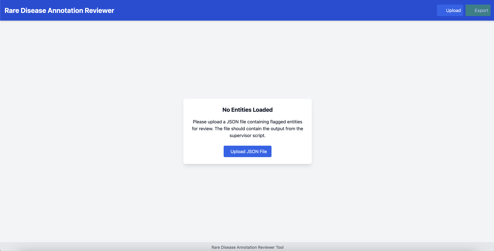
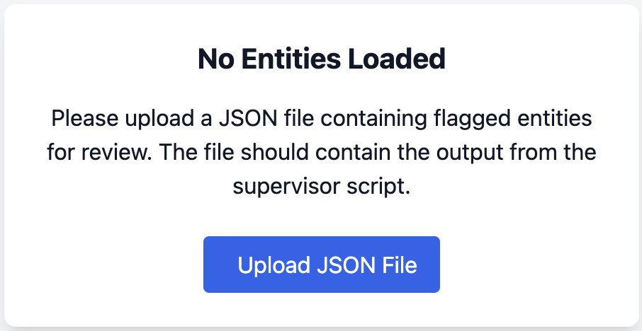
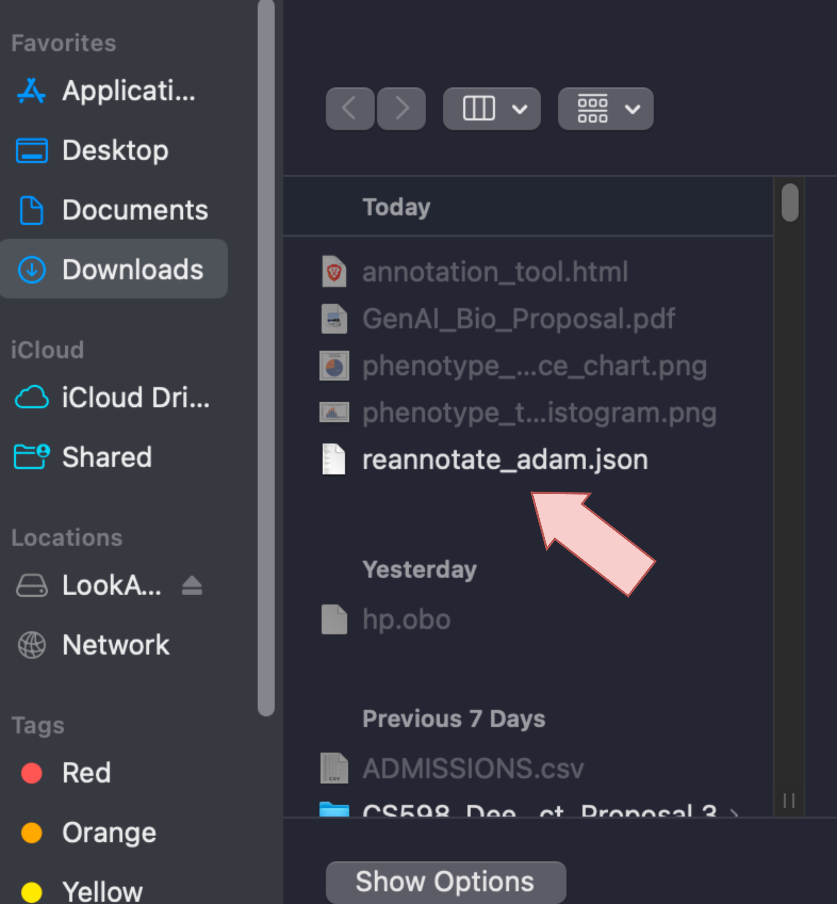
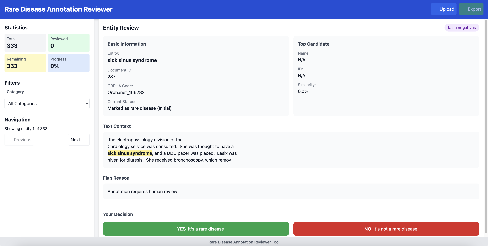
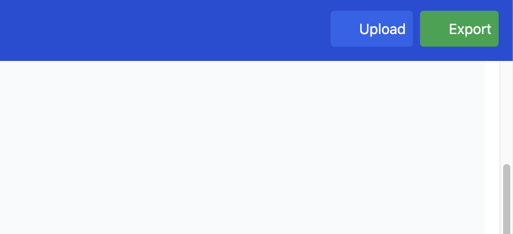

# RDMA - Rare Disease Mining Agents

For people who know how to use Git:

    git clone https://github.com/jhnwu3/RDMA.git

For others, on GitHub, there's a "Download Zip" button on the Green "Code" Button. You'll need to unzip manually yourself.

To get the prerequisite dependencies, please:
    
    pip install -r requirements.txt

Download these prerequisite files for the embedded documents [here.](https://drive.google.com/file/d/16wpcexHf2KDZ4w2qBHrTp8dn1oa59ABM/view?usp=sharing)

Make sure to unzip the files and place them in a location where you can reference their pathing.

To see how to use RDMA, we have provided a jupyter notebook:

    example.ipynb

## Publicly available data

We source our clinical case study annotations from the excel file from [RAG-HPO](https://github.com/PoseyPod/RAG-HPO) and provide it as a .json file in the directory: 
    
    public_data/phenotype_mining_benchmark.json

We show three variants of our MIMIC3 rare disease mention annotations. 

First, we showcase the original set from [here](https://github.com/acadTags/Rare-disease-identification/tree/main/data%20annotation)

    public_data/rd_annos.json

Next, we showcase the keyword filtered version:

    public_data/filtered_rd_annos.json

Then, we showcase the human-reannotated version:

    public_data/reannotated_rd_annos.json

To get the clinical note counterpart, please see the [MIMIC-III](https://physionet.org/content/mimiciii/1.4/) dataset.

## Using the provided annotation UI
We note that it is possible to use our existing annotation tool locally. Simply, double click or open **annotation_tool.html**, and you'll be greeted with this interface below:

Simply click the upload button and upload your .json file. 

Upload your file.

Then, you'll be greeted with the annotation display where you can click next, and declare whether or not an entity is a rare disease or not.

Once you're done, hit the green export button in the top right, it will ask to save a corrections .json file. 

Some important notes:

**Sometimes you'll see a "[Entity 'heparin induced thrombocytopenia' occurrence #1 (index 0) not found by string search or overlaps with previously used positions in document 2541 ORPHA:Orphanet_3325]", which implies the annotation entity was never found in the text"**

**Do not refresh the page or you will lose all of your progress. Do not exit on accident. There's no database or backend that's tracking your annotations.**